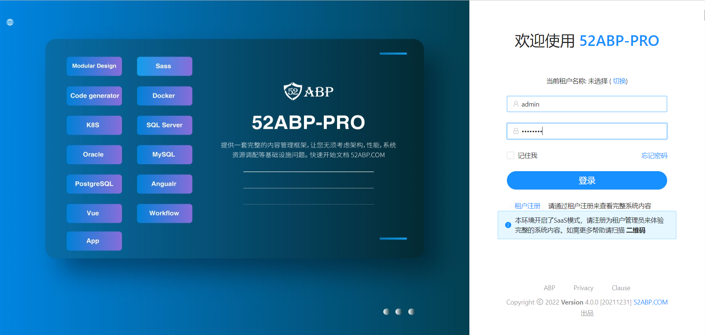
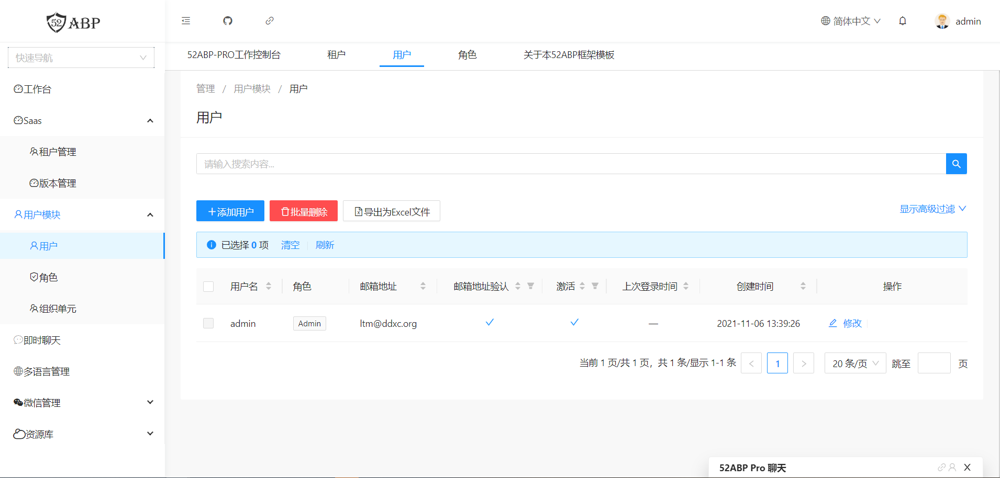
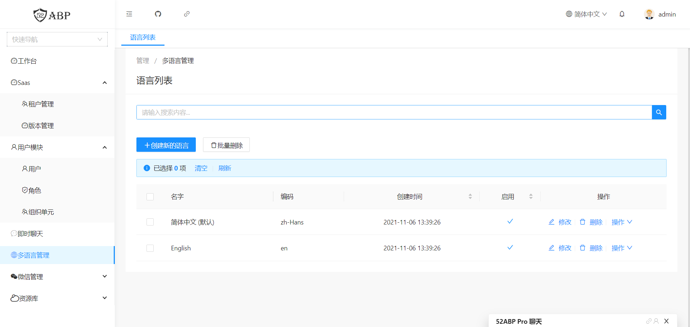
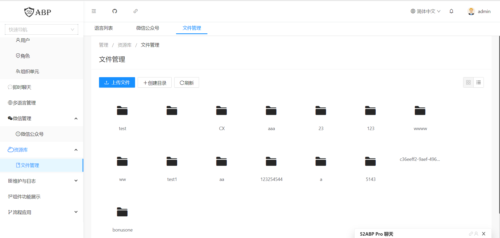
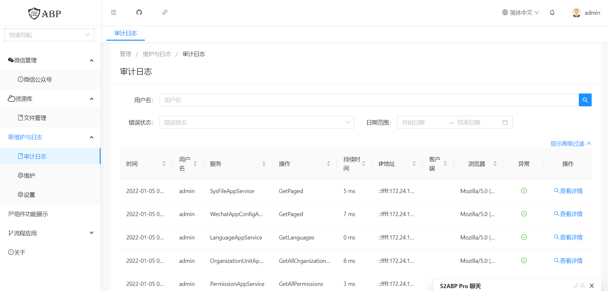
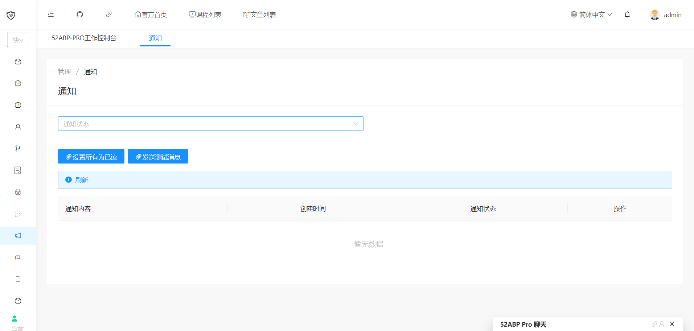
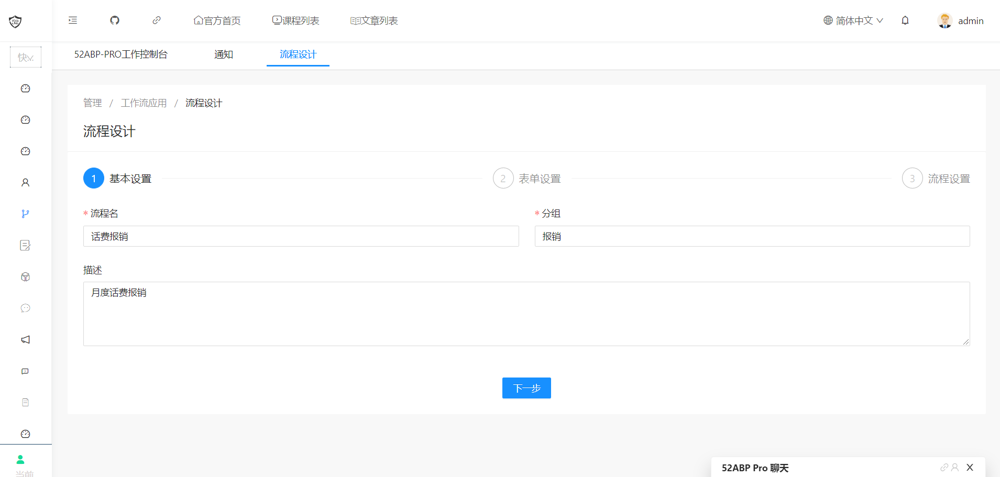
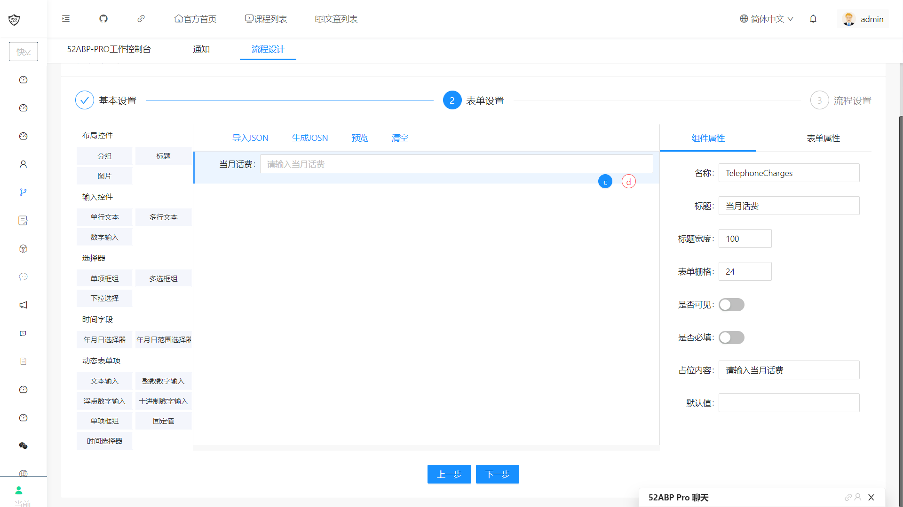
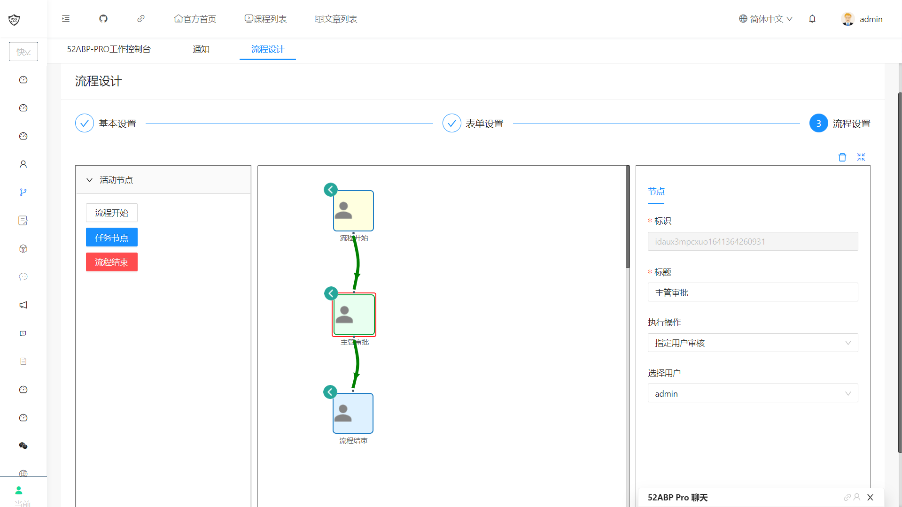
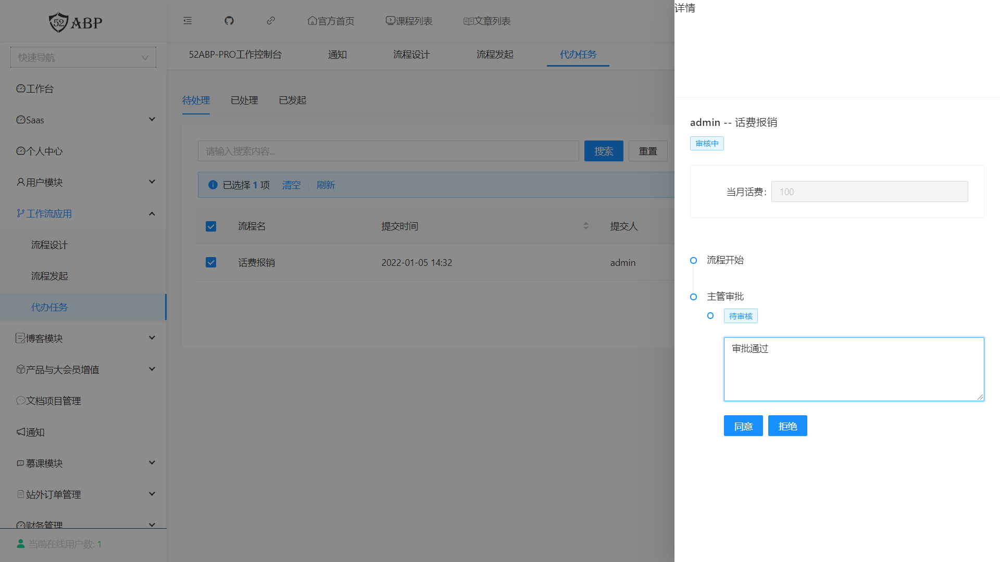

<h3 align="center">企业级应用开发框架（52Abp）</h3>

<h4 align="center">支持模块化、多租户、用户角色权限、工作流等功能的现代企业级应用开发框架</h4>


------------------------------------------------------------------------

官方网站：https://www.52abp.com/ 

微信群（扫码关注公众号回复 **加群**）：

[](https://www.52abp.com/)

```shell
如果对您有帮助，您可以点右上角 “Star” 收藏一下 ，获取第一时间更新，谢谢！
```

------------------------------------------------------------------------

#### 💐 52Abp企业级应用开发框架介绍
> 52Abp企业级开发框架是对Abp框架进行扩展，核心技术栈为 .NET5、EntityFrameworkCore、Automapper、Angular、NG-ZORRO、NG-ALAIN、Ionic、WorkflowCore 的一套企业级应用开发框架；前后端分离，分布式部署，集群部署，跨平台运行，容器支持，DevOps适配；拥有模块化、多租户、版本管理、多语言、用户、角色、权限、组织架构、审计日志、工作流、表单设计器、后台任务、审计日志、系统设置、事件总线、消息通知、即时聊天等众多特性和功能。

> 模块化的设计让 52Abp 框架易于扩展，天然对多租户的支持更是让开发 SASS 场景应用得心应手。搭配代码生成器与模块化生成器可实现规范高效率开发。

#### 🍔 功能介绍

- 多租户：开启多租户可管理租户，并对每个租户做到业务功能的开放和限制
- 认证管理：经典的RBAC模型设计，基于 ASP.NET Core Identity 开发，功能强大且易于扩展
- 审计日志：记录每一次对外接口访问，精确到输入输出字段级别
- 系统设置：管理应用系统的配置，按需可实现到用户级细粒度
- 工作流：基于 WrokflowCore 开发，配合自研表单设计器，满足大部分对工作流场景的需求
- 后台任务：内置后台任务，支持 Hangfire 等第三方后台任务组件
- 消息通知：基于 SignalR 开发，实时推送消息到浏览器、客户端，并支持微信通知、短信通知、企业微信、钉钉等应用
- 多语言：多语言模块，助力业务系统走向全球
- 模块化：模块化是整个框架的灵魂的重要部分，它使52Abp成为一个扩展性极佳、编码标准化的框架

#### 🎃 前端介绍 

使用 Google Angular 框架，移动端使用 Angular 搭配 Ionic，结合 NG-Zorro / NG-Alain，丰富的组件和生态可实现更多的交互细节，我们倾尽全力提供更加流畅、舒适的产品体验，前后端分离的架构实现一个后台，可管理多个前端，不论是 Web、小程序、APP、桌面程序 都可快速接入后台框架。

#### 🎏 后端截图  
| 后端 | 截图 |
|---------------------|---------------------|
|   ||
|||
|||
|||
|||

#### 🎨 系统演示  

后端管理演示地址：http://pro.52abp.com

> 注意！请注册一个租户进行体验

### 🌈 技术选型

#### 🏢 后端框架结构说明  


| 技术                        | 名称                 | 版本                                                         |
| --------------------------- | -------------------- | ------------------------------------------------------------ |
| Asp.Net Core            | 基础框架             | [](https://www.nuget.org/packages/Microsoft.AspNetCore/)  [](https://www.nuget.org/packages/Microsoft.AspNetCore/) |
| Asp.Net Core WebApi         | Web Api框架              | [](https://www.nuget.org/packages/Microsoft.AspNet.WebApi.Core/)  [](https://www.nuget.org/packages/Microsoft.AspNet.WebApi.Core/) |
| Swagger                     | Open API标准文档框架 | [](https://www.nuget.org/packages/Swashbuckle.AspNetCore/)  [](https://www.nuget.org/packages/Swashbuckle.AspNetCore/) |
| Castle.Windsor              | IOC框架              | [](https://www.nuget.org/packages/Autofac.Extensions.DependencyInjection/)  [](https://www.nuget.org/packages/Castle.Windsor.MsDependencyInjection/) |
| EntityFrameworkCore         | ORM框架              | [](https://www.nuget.org/packages/Microsoft.EntityFrameworkCore/)  [](https://www.nuget.org/packages/Microsoft.EntityFrameworkCore/) |
| AutoMapper                  | 实体映射             | [](https://www.nuget.org/packages/AutoMapper/)  [](https://www.nuget.org/packages/AutoMapper/) |
| Redis                       | 数据缓存             | [](https://www.nuget.org/packages/StackExchange.Redis/)  [](https://www.nuget.org/packages/StackExchange.Redis/) |
| Asp.Net Core Identity       | 授权认证             | [](https://www.nuget.org/packages/Microsoft.Extensions.Identity.Core/)  [](https://www.nuget.org/packages/Microsoft.Extensions.Identity.Core/) |
| HangFire                    | 定时任务             | [](https://www.nuget.org/packages/HangFire/)  [](https://www.nuget.org/packages/HangFire/) |
| Senparc.Weixin | 微信SDK              | [](https://www.nuget.org/packages/Senparc.Weixin/)  [](https://www.nuget.org/packages/Senparc.Weixin/) |
| NG-ZORRO                  | 后端管理UI框架       | [](https://ng.ant.design/docs/introduce/zh)  [](https://ng.ant.design/docs/introduce/zh) |


#### 🍭 后端技术看点
- 前后端完全分离，接口与管理端为独立项目 (互不依赖、互不影响、开发效率高)
- 采用跨平台的 Asp.Net Core 5.0 框架
- 采用 RBAC 基于角色的权限控制管理，可颗粒化配置用户、角色可访问的数据权限
- 采用 NG-ZORRO（企业级中后台产品UI组件库）作为后端UI框架
- 使用 Swagger，并以 OpenApi 标准生成 api 文档
- 使用 Automapper 处理对象映射
- 使用 Castle.Windsor 做依赖注入容器，并提供接口实现服务自动注册
- 支持 Redis 做缓存和消息队列的处理
- 支持 CORS 跨域和HTTPS，保证接口安全
- 使用Asp.Net Core Identity实现JWT认证，支持集成IdentityServer4，实现基于OAuth2的登录体系
- 使用 Log4Net 日志框架，可配合官方日志库 Microsoft.Extensions.Logging 提供的 ILogger 接口做日志记录
- 除内置后台任务以外，支持使用 HangFire 做定时任务处理
- 已支持 SqlServer、MySql、Oracle、PostgreSQL 数据库，理论上支持所有数据库，并支持读写分离和多库操作
- 使用 Senparc.Weixin 作为微信公众号及小程序对接组件


#### 👒 前端框架  

| 技术     | 官网                      | 版本   | 描述               |
| -------- | ------------------------- | ------ | ------------------ |
| Angular  | https://angular.io/ |    12.x    | 企业级大型前端开发平台 |
| NG-ZORRO | https://ng.ant.design/docs/introduce/zh | 12.X | 组件功能强丰富 |
| NG-ALAIN | https://ng-alain.com/zh | 12.X | 提供更多通用性业务模块，让开发者更加专注于业务 |


### 📀 开发环境

- Visual Studio 2019 16.8 +
- .NET 5 SDK +
- Visual Studio Code
- SQL Server Management Studio
- Redis Desktop Manager
- Docker Desktop
- Powershell 7
- NodeJS v16.13.1+


### 💝 运维环境

- [x] （必选）.NET 5 Runtime
- [x] （必选）Windows IIS7.5+ / Docker / k8s 等支持环境
- [x] （必选）SQLServer 2012R2+ / MySQL 5.7+ / Oracle11g+ / PostgreSQL 10+
- [ ] （可选）Redis 3.0+
- [ ] （可选）支持https协议的域名
- [ ]  （可选）阿里云OSS/腾讯云COS


### ⛵ 安装及说明文档
- 由于文档内容较多且目前我们人手有限，请加微信群后在群文件获取，或访问官网 [https://www.52abp.com](https://www.52abp.com) 在线浏览。
- 已经支持 linux 下 docker-compose 部署，可配合 gitlab + gitrunner 实现持续集成，具体请查看代码中 【.gitlab-ci.yml】和【docker-compose.yaml】文件


### 🎏 版权须知


### 👏 贡献代码


### 💘 支持
- 希望 52Abp 框架对您有用，您的支持也是让 52Abp 持续进步的动力，52Abp 有您更精彩！

- 感谢以下小伙伴对我们的支持，捐赠列表将不定期更新；如有疏漏或错误请联系我们更正，捐赠人员将免费获得我们后期推出的商业咨询服务；捐赠金额将用于演示服务器，redis，mysql等硬件资源开支。

| 序列 | 昵称                       | 捐赠金额（元） | 日期       |
| ---- | -------------------------- | -------------- | ---------- |


### ☀️ 组织  


### 🎉 鸣谢

